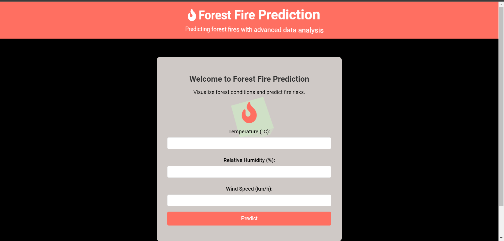

# Forest Fire Prediction

This project aims to predict the occurrence of forest fires using machine learning. The project includes a Flask-based application that serves both backend (for model training and prediction) and frontend (for user interaction).

# Web Page: (Created with ❤ using Threejs Models)



## Folder Structure

- `app.py`: Main application file combining both frontend and backend.
- `model/`: Contains the trained model and script to train the model.
- `requirements.txt`: Dependencies for the project.
- `static/`: Static files (CSS, JS).
- `templates/`: HTML templates.
- `data/`: Folder containing the dataset.

## DATASET  INFORMATION:

Download the dataset from [UCI Machine Learning Repository](https://archive.ics.uci.edu/ml/datasets/Forest+Fires) and place the `forestfires.csv` file in the `data/` folder.

## Installation

1. Clone the repository:

     ```bash
     git clone https://github.com/Blacksujit/Forest_fire_Prediction.git
     ```

2. Install the dependencies:
    ```bash
    pip install -r requirements.txt
    ```

3. Run the application:
    ```bash
    python app.py
    ```
4. Open your browser and go to `http://127.0.0.1:5000` to use the application.

## License

This project is licensed under the MIT License.
